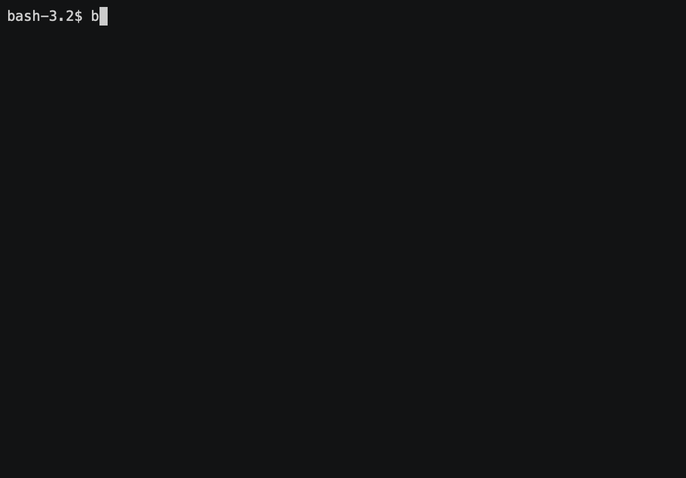

## Badges:

## Description:
Five simple console games, aimed to warm-up your brains!

## Installation:
composer require artems/brain:dev-master

## Gameplay: 
To start playing just type in console one of the game:
1. brain-even
2. brain-calc
3. brain-gcd
4. brain-progression
5. brain-prime
6. brain-games (that's game just for testing, there is no gameplay)

## Asciinema :

Brain-even: [link](https://asciinema.org/a/Nn6UCMzzaYB3Z97P61q6ryt6m)

Brain-calc: [link](https://asciinema.org/a/4YklKWjYxebj8lS3gB4nmpksl)

Brain-gcd: [link](https://asciinema.org/a/ZtRvw0wQMezwdwQpM40PLnnUl)

Brain-progression: [link](https://asciinema.org/a/BaScM0BReyrUTo0DtUuU973Ju)

Brain-prime: [link](https://asciinema.org/a/QCLCxQG6LWWCyxnJW7Gfn8LVx)